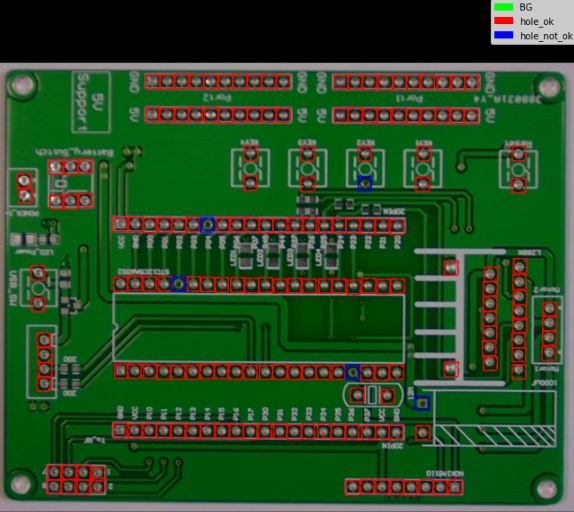

# Mask R-CNN for Blowholes Detection and Recognition in PCBs

This is an application and an extension of the [Mask R-CNN for Object Detection and Segmentation](https://github.com/matterport/Mask_RCNN) from matterport.

The goal of this repository is to expose in a very concise way the Mask R-CNN model application for the recognition of blowholes in PCB images for my Final Degree Project.

The repository includes:
* Source code of Mask R-CNN built on FPN and ResNet101 modified by the user.
* PCB dataset for blowholes detection.
* Training code for MS COCO.
* Pre-trained weights for MS COCO.
* Google Colab code in Python to execute all the project.
* Confusion matrix code to visualize training results.

## 1. INTRODUCTION
This project proposes to implement a Deep Learning algorithm capable of detecting and classifying if a hole in a printed circuit board (PCB) is properly or not, depending on the existence of gaps in the weld. It is an algorithm applied to the electronics industry that uses artificial intelligence.

First, a dataset of images has been extracted with the goal that the algorithm can detect and classify the holes in different PCBs. This dataset has been extracted from the Internet on the Kaggle page, which has a large number of image datasets. The images have been distributed so that 75% go for the training, 15% for the testing and 10% for validation.

## 2. DATASET
The dataset for this project has been acquired from the Kaggle dataset [PCB Defects](https://www.kaggle.com/datasets/akhatova/pcb-defects). For this project, only the Missing Hole image directory has been used.

For the image labeling [LabelImg](https://github.com/tzutalin/labelImg) has been used. The dataset class of the code has been designed with the objective that can recognize image masks of JSON structure generated by this labeling program.

## 3. MASK VERIFICATION
First to train the model, it's important to verify that the methos previously dessigned to detect labels from JSON works.

To do that random images are chosen to visualize their masks:

## 4. TRAINING THE MODEL
For model training has been used 50 epochs for training latest layers and 59 epochs for training all the layers.

This is how loss function of the model during the 109 epochs looks:

## 5. DETECTION EXAMPLE
The method load_image_gt is used for return a random images with the detected masks by the trained model.

The results are saved in a vector with classes and masks detected by the model and teh results are visualized with method display_instances.

This method in `mrcnn/visualize.py` has been modified by the user for visualize every class with a different color and a legend for recognize the classes.

## 6. RESULTS WITH CONFUSION MATRIX
The confusion matrix code has been obtained from repository [Confusion-matrix-for-Matterport-implementation-of-Mask-R-CNN](https://github.com/Altimis/Confusion-matrix-for-Mask-R-CNN).

The document `mrcnn/utils_cm.py` has been added to this repository for be able to call confusion matrix methods.

Here are the results after 109 epochs of training:

The method plot_confusion_matrix_from_data in `mrcnn/utils_cm.py` for the confusion matrix visualization has been modified for can read real class names in columns and rows instead class (A, B, C...).

The total precission of the model is 62,31% detecting with success 63,55% of the solded holes and the 32,56% of the blowholes.

This results can be so better taking into account that a third part of the solded holes are detected as background.

For future modifications it is clear that the model have to be trained with mora number of images and epochs. Despite this, it can be concluded that theoretical knowledge has been acquired to
be able to carry out this project and be able to develop a convolutional neural network.

